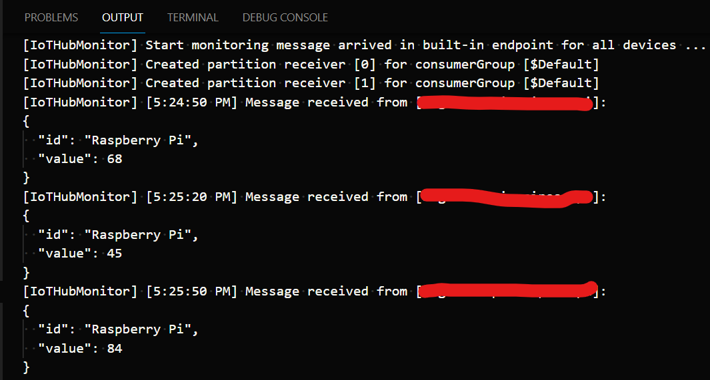
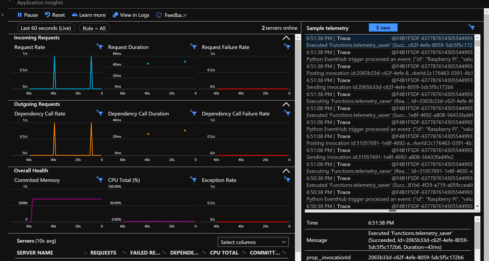

# Getting telemetry from a Raspberry Pi to Azure

## Overview

Get started with Azure IoT Hub and Raspberry Pi! This sample projects has everything you need to get data from your Raspberry Pi to Table Storage in Azure. The code here is meant to be a starting point for your project. In this sample we set up 3 Azure resources, an IoT Hub, Functions, and Table Storage. IoT Hub connects internet enabled devices to other Azure services, Functions offers serverless compute which we use to process and save the data, and Table Storage is a no SQL database so we have somewhere to keep the data. The only services in this sample that does not offer a free tier is Table Storage.

## Prerequisites

1. An active Azure account. If you don't have one, you can sign up for a [free account](https://azure.microsoft.com/free/).
1. [VS Code](https://code.visualstudio.com/Download)
1. [Azure IoT Hub](https://marketplace.visualstudio.com/items?itemName=vsciot-vscode.azure-iot-toolkit), [Azure Functions](https://marketplace.visualstudio.com/items?itemName=ms-azuretools.vscode-azurefunctions), and [Azure Storage](https://marketplace.visualstudio.com/items?itemName=ms-azuretools.vscode-azurestorage) extension for VS Code
1. [Azure CLI](https://docs.microsoft.com/en-us/cli/azure/install-azure-cli?view=azure-cli-latest)
1. [Azure Functions Core Tools](https://docs.microsoft.com/en-us/azure/azure-functions/functions-run-local#install-the-azure-functions-core-tools)
1. [Python 3](https://www.python.org/downloads/)
1. Hardware listed below

### Hardware

| Item | Description | Link |
|-|-|-|
| Raspberry Pi 3 or 4 | Single board computer | [Adafruit](https://www.adafruit.com/product/4292) |
| USB C power supply (Pi 4) | Power cable for Raspberry Pi 4 | [Adafruit](https://www.adafruit.com/product/4298) |
| Micro USB USB power supply (Pi 3) | Power cable for Raspberry Pi 3 | [Adafruit](https://www.adafruit.com/product/1995) |
| SD Card with Raspberry Pi OS | Operating system for the Pi | [Adafruit](https://www.adafruit.com/product/4266) |

## Setup Azure Resources

First you'll provision the Azure resources needed for this sample. You're going to use IoT Hub, Azure Functions, and Table Storage. We'll also setup a budget, so you can get a warning if your services are racking up a big bill.

| Resource | Description | Link |
|-|-|-|
| IoT Hub | Two way IoT communication platform | [Azure](https://azure.microsoft.com/en-us/services/iot-hub/) |
| Azure Functions | Serverless compute platform | [Azure](https://azure.microsoft.com/en-us/services/functions/) |
| Table Storage | No SQL database | [Azure](https://azure.microsoft.com/en-us/services/storage/tables/) |

### Preparing your environment

1. If you haven't already, clone this repo to your computer

1. Open command prompt or terminal and navigate to *pi-azure-recipes*

1. Add the IoT devices capability to your subscription. In your terminal execute each of the following commands, replacing `<VARIABLE>` as needed:
   ```bash
   az login
   az account set -s '<YOUR SUBCRIPTION NAME>'
   az provider register --namespace Microsoft.Devices
   ```

1. In command prompt or terminal type and run ```code 01_iot```. This will open the project folder in VS Code

1. Press *F1* to open the command palette, search for and select **Azure Functions: Create New Project**

1. Choose *browse*, and select the folder named *data_processing*

1. Select *Python* for programing language and then select the interpreter path
    > *Note: Only python version 3.6, 3.7, and 3.8 are supported*

1. Select *Skip for now* for template

1. Select *No* for all the prompts in the creation process

1.  Your function is now initialized in VS Code

### Create IoT Hub

1. Next you'll set up and IoT Hub. This will deploy a resource on Azure

1. Press *F1* to open the command palette, search for and select **Azure IoT Hub: create IoT Hub**

1. Select your subscription, then select *+ Create Resource Group*

1. Give your resource group a name

1. Select a Location that is located near you

1. Select *F1: Free* for the pricing tier
    > Note: You can only have one free tier active per account

1. The IoT Hub should now appear in the *Azure IoT Hub* tab

1. Now we need to get some information using [Azure CLI][azure-cli]

1. First, we need to sign in. Open a terminal and execute each of the following commands, replacing `<VARIABLE>` placeholders as needed:
   ```bash
   az login
   az account set -s '<YOUR SUBCRIPTION NAME>'
   ```
1. Now let's retrieve the connection string for the built-in event endpoint:
   ```bash
   az iot hub connection-string show -n '<IOT HUB NAME>' --default-eventhub --query connectionString
   ```
1. Copy the connection string. Don't close this yet, we'll come back to it in a second!
   
1. In in te *data_processing* folder, open the *local.settings.json* file that was created with your function

1. Add the connection string to *Values* with the variables name **"IoTHubConnectionString"**. It should look similar to the following:
    ```json
    "IoTHubConnectionString": "Endpoint=sb://<NAMESPACE>.servicebus.windows.net/;SharedAccessKeyName=iothubowner;SharedAccessKey=<SHARED_ACCESS_KEY>;EntityPath=<EVENT_HUB_NAME>"
    ```
1. Now let's get the build-in event endpoint name:
   ```bash
   az iot hub show --name '<IOT HUB NAME>' --query properties.eventHubEndpoints.events.path
   ``` 

1. In the same *local.settings.json*, add a new key called **eventHubName** in the *Values* section and set the value to the output from the previous step. It should look similar to the following:
   ```json
   "eventHubName": "iothub-ehub-xxxxxxxxxx-xxxxxxxx-xxxxxxxxxx"
   ```

### Create storage account

1. Press *F1* to open the command palette, search for and select **Azure Storage: Create Storage Account**

1. Select your subscription

1. Give you storage account a name
    > Note: this name has to be globally unique

1. Open the command palette, search for and select **Azure Storage: Copy Connection String**

1. Open the *local.settings.json* file that was created with your function.

1. Add the connection string to *Values* with the variables name **"AzureWebJobsStorage"**
    ```json
    "AzureWebJobsStorage": "DefaultEndpointsProtocol=https;AccountName=<STORAGE_ACCOUNT_NAME>;AccountKey=<ACCOUNT_KEY>;EndpointSuffix=core.windows.net"
    ```

### Setup your Raspberry Pi Device

1. Press *F1* to open the command palette, search for and select **Azure IoT Hub: Create Device**

1. Give the device a name

1. The connection string for the device should print in the Output window, note this connection string, you'll need later on your Raspberry Pi

1. Connect your raspberry Pi to a monitor and keyboard or use the the instructions [here](https://github.com/microsoft/rpi-resources/tree/master/headless-setup) to setup your pi for SSH

1. Using a USB drive or an SSH file transfer software move the files in the *client* folder to the Pi

1. Run the *python_environment_setup.sh* shell script:

   ```bash python_environment_setup.sh```

1. Once the script finishes open the newly created *.env* file

1. Paste the device connection string between the single quotes. It should look similar to the following:
    ```
    CONNECTION_STRING='HostName=<IOTHUB_NAME>.azure-devices.net;DeviceId=<DEVICE_NAME>;SharedAccessKey=<SHARED_ACCESS_KEY>'
    ```

1. In the client folder on your Pi type
    ```sh
    source ./.venv/bin/activate
    ``` 
1. Then type
    ```sh
    python raspberry_pi_client.py
    ```

1. Your device is now sending telemetry to IoT Hub

### Monitoring locally
This will let you see the raw messages being sent by the Raspberry Pi.

1. In the VS Code, open the command palette with the `F1` key 

1. Search for and select "Azure IoT Hub: Start monitoring built-in event endpoint" 

1. You should see the telemetry from the Pi in the terminal windows
   
   
1. To stop monitoring, open the command palette and select "Azure IoT Hub: Stop monitoring built-in event endpoint"

### Deploying your function

1. Open *data_processing\telemetry_saver\function.json*
   
1. Press *F1* to open the command palette, search for and select *Azure Functions: Deploy to function app*

    > Note: this will create a few resources in your Azure subscription

1. Select "Create new Function App in Azure" and give your function app a name

1. Select Python 3.8

1. Select a region near where you are located

1. When the function deployment completes you will be given the option to upload your local settings. Select *Upload settings* to upload your connection string to the App settings in Azure

### Monitoring remotely
Let's see your function executing on Azure!

1. Open the command palette

1. Search for and select *Azure Functions: Start Streaming Logs*, press Enter

1. This will open Azure in your browser. You should see something similar like this:
   

## Clean up Resources

If you keep the resources you provisioned you'll continue to incur costs on them. Let's clean them up!

1. In Visual Studio Code, press *F1* to open the command palette. In the command palette, search for and select *Azure Resource Groups: Delete...*

1. Choose your resource group, and press Enter. Follow the prompt(s).

1. Now let's delete the storage. Open the command palette again and search for and select *Azure Storage: Delete Storage Account...*

1. Select the storage account to delete and press Enter
   
1. Double-check and confirm your decision when you are prompted.

Deletion may take a couple of minutes. When it's done, a notification appears for a few seconds. You can also select the bell icon at the top of the page to view the notification.

<!-- Links -->
[azure-cli]: https://docs.microsoft.com/en-us/cli/azure/install-azure-cli?view=azure-cli-latest "Install Azure CLI"
