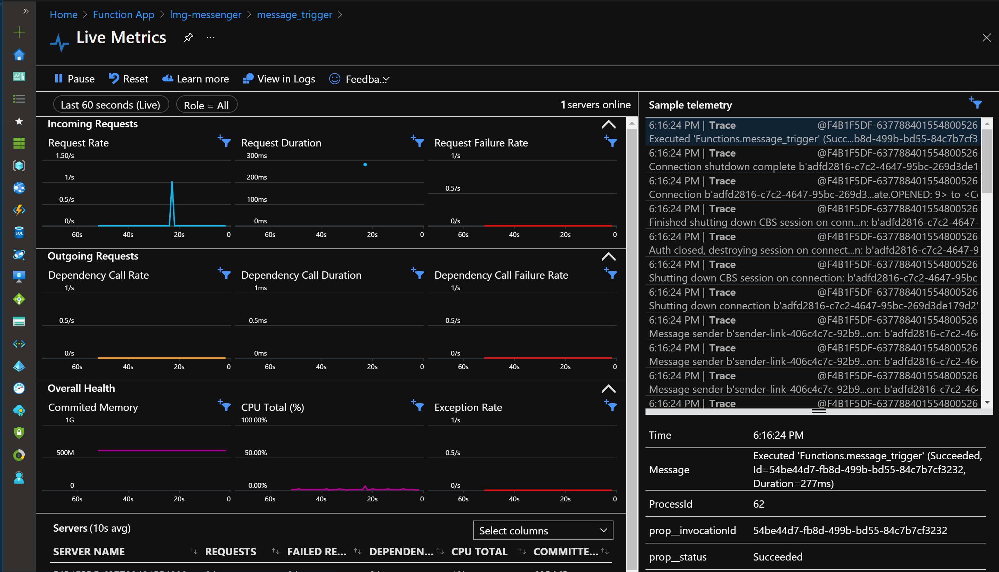

# Getting message from Azure to Raspberry Pi

## Overview

Getting messages from Azure to your Raspberry Pi is a useful tool for many IoT scenarios. You can turn on a fan in a greenhouse, start a machine in a production line, or change the type of telemetry being captured at a remote location. In this tutorial we'll show you how to setup an IoT Hub and us an Azure Function to send a simple message to your Raspberry Pi. We then parse the message on the Pi and print out the message. You can use this project as a starting point for you next IoT project!

## Prerequisites

1. An active Azure account. If you don't have one, you can sign up for a [free account](https://azure.microsoft.com/free/).
1. [VS Code](https://code.visualstudio.com/Download)
2. [Azure IoT Tools](https://marketplace.visualstudio.com/items?itemName=vsciot-vscode.azure-iot-tools) and [Azure Functions](https://marketplace.visualstudio.com/items?itemName=ms-azuretools.vscode-azurefunctions) extensions for VS Code
3. [Azure CLI](https://docs.microsoft.com/en-us/cli/azure/install-azure-cli?view=azure-cli-latest)
4. [Azure Functions Core Tools v3](https://docs.microsoft.com/en-us/azure/azure-functions/functions-run-local#install-the-azure-functions-core-tools)
5. [Python 3.8](https://www.python.org/downloads/)
6. Hardware listed below


### Hardware

| Item                              | Description                    | Link                                              |
| --------------------------------- | ------------------------------ | ------------------------------------------------- |
| Raspberry Pi 3 or 4               | Single board computer          | [Adafruit](https://www.adafruit.com/product/4292) |
| USB C power supply (Pi 4)         | Power cable for Raspberry Pi 4 | [Adafruit](https://www.adafruit.com/product/4298) |
| Micro USB USB power supply (Pi 3) | Power cable for Raspberry Pi 3 | [Adafruit](https://www.adafruit.com/product/1995) |
| SD Card with Raspberry Pi OS      | Operating system for the Pi    | [Adafruit](https://www.adafruit.com/product/2820) |

## Setup Azure Resources

First we'll provision the Azure resources we need for this sample. We're going to use IoT Hub, Azure Functions, and Table Storage. We'll also setup a budget, so you can get a warning if your services are racking up a big bill. We provide two ways to provision the resources, you can walk through the step by step instructions or deploy all the resources at once using an Azure Resource Manager template.

| Resource        | Description                        | Link                                                                |
| --------------- | ---------------------------------- | ------------------------------------------------------------------- |
| IoT Hub         | Two way IoT communication platform | [Azure](https://azure.microsoft.com/en-us/services/iot-hub/)        |
| Azure Functions | Serverless compute platform        | [Azure](https://azure.microsoft.com/en-us/services/storage/tables/) |

### Preparing your environment

1. If you haven't already, clone this repo to your computer

1. Open a terminal and navigate to *pi-azure-recipes*

1. We need to add the IoT devices capability to your subscription. In your terminal execute each of the following commands, replacing `<VARIABLE>` as needed:
   ```bash
   az login
   az account set -s '<YOUR SUBCRIPTION NAME>'
   az provider register --namespace Microsoft.Devices
   ```
1. In your terminal run `code 02_c2d`. This will open the project folder in VS Code.

1. Press *F1* to open the command palette, search for and select *Azure Functions: Create New Project*

1. Choose browse, and select the folder named *messenger*

1. Select *Python* for programing language and then select the interpreter path
    > *Note: Only python version 3.6, 3.7, and 3.8 are supported*

1. Select *Skip for now* for template

1. Select *No* for all the prompts in the creation process

1. Your function is now initialized in VS Code

### Setup IoT Hub

1. Next you'll set up and IoT Hub. This will deploy a resource on Azure.

1. Open the command palette in VS Code, search for and select *Azure IoT Hub: Create IoT Hub*

1. Select your subscription 

1. Select *+ Create Resource Group* and provide a name

1. Select a [region that is nearest you](https://azure.microsoft.com/en-us/global-infrastructure/geographies/#geographies).
   
1. Select the *F1: Free Tier*
   > :zap: You can only have one IoT Hub using the free tier

1. Open the command palette, search for and select  *Azure IoT Hub: Copy IoT Hub Connection String*

1. Open the *local.settings.json* file that was created with your function.

1. Add the connection string to *Values* with the variable *IoTHubConnectionString*
    ```json
    "IoTHubConnectionString": "HostName=<IOT_HUB_NAME>.azure-devices.net;SharedAccessKeyName=iothubowner;SharedAccessKey=<SHARED_ACCESSKEY>"
    ```
1. We also need to add your device ID to the *local.settings.json* file. This is the name you gave your device upon creation. If you don't remember it, it should be listed in the side bar in the *Azure IoT Hub* view under *Devices*.
   ```json
   "DeviceId": "<DEVICE_ID>"
   ```
1. Once you're finished, your *local.settings.json* should look like this:
    ```json
    {
        "IsEncrypted": false,
        "Values": {
            "FUNCTIONS_WORKER_RUNTIME": "python",
            "FUNCTIONS_EXTENSION_VERSION": "~3",
            "IoTHubConnectionString": "HostName=<IOT_HUB_NAME>.azure-devices.net;SharedAccessKeyName=iothubowner;SharedAccessKey=<SHARED_ACCESSKEY>",
            "DeviceId": "<DEVICE_ID>"
        }
    }
    ```

#### Setup your Raspberry Pi Device

1. Open the command palette, search for and select *Azure IoT Hub: Create Device*

1. Give the device a name

1. The connection string for the device should print in the *Output* window, copy or save this connection string, you'll need it later on your Raspberry Pi

1. Connect your Raspberry Pi to a monitor and keyboard or use the the instructions [here](https://github.com/microsoft/rpi-resources/tree/master/headless-setup) to setup your Pi for SSH

1. Using a USB drive or an SSH file transfer software move the files in the *client* folder to the Pi

1. Run the *python_environment_setup.sh* shell script

1. Once the script finishes open the sample *.env* file

1. Paste the device connection string there, it should look similar to the following:
    ```shell
    CONNECTION_STRING='HostName=<IOT_HUB_NAME>.azure-devices.net;DeviceId=<DEVICE_ID>;SharedAccessKey=<SHARED_ACCESSKEY>'
    ```

1. Activate your Python virtual environment. In a terminal, navigate to the *client* folder and type
    ```sh
    source ./.venv/bin/activate
    ```

1. Then type to start your client
    ```sh
    python raspberry_pi_client.py
    ```

1. Your device is now ready to receive telemetry from IoT Hub

### Test your function locally

1. Open a terminal and navigate to the *messenger* folder

1. Let's start our function! In your terminal, run:
   ```sh
   func host start
   ```
   > :memo: The function runtime host can take about a minute to start.
    
   > :bug: There is a known issue when downloading an external resource can fail, if you encounter it, simply delete the `extensionBundle` section from your *host.json* file.

1. Once your function has started, you'll see a url that looks like
    ```sh
    Functions:

        message_trigger: [GET,POST] http://localhost:7071/api/message_trigger
    ```

1. Copy the url and add *?status=on* to the end of it so it reads
    ```
    http://localhost:7071/api/message_trigger?status=on
    ```
    > :memo:  This is your trigger to activate an action on your Raspberry Pi, so make sure that *raspberry_pi_client.py* is still running!

1. Open a web browser and paste the url from the previous step

1. Your Pi should print out ```Device is on```

### Deploy your function to Azure

1. Press *F1* to open the command palette, search for and select *Azure Functions: Deploy to function app*
    > :memo: This will create a few resources in your Azure subscription

1. Select "Create new Function App in Azure... Advanced"

1. Give your function app a name

1. Select *Python 3.8*

1. Select the resource group you created for your IoT Hub

1. Select a [region near where you are located](https://azure.microsoft.com/en-us/global-infrastructure/geographies/#geographies)

1. Select *Consumption* for your hosting plan

1. Select *Create a new storage account* and provide a name

1. Select *+ Create new Application Insights resource* and provide a name
    > :sparkle:  Application Insights help you monitor the health and usage of your function.

1. When the function deployment completes you should be given the option to upload your local settings. Select *Upload settings* to upload your connection string to the App settings in Azure. 
    If not, open the command palette, search for and select *Azure Functions: Upload Local Settings* and select your function app.

### Monitoring remotely
Let's see your function executing on Azure!

> :memo:  Make sure that *raspberry_pi_client.py* on your Pi is still running!

1. Open the command palette

1. Search for and select *Azure Functions: Start Streaming Logs*, press Enter.

1. This will open Azure in your browser. You should see something similar to this:
   

1. Open the command palette in VS Code, search for and select *Azure Functions: Execute Function Now...*

1. Select your subscription

1. Select your function app

1. Select your function *message_trigger*

1. In the box enter `{ "status": "on" }`

1. Your Pi should print `Device is on` and the Live Metrics dashboard should show telemetry that `Functions.message_trigger` was executed successfully.

## Clean up Resources

If you keep the resources you provisioned you'll continue to incur costs on them. Let's clean them up!

1. In Visual Studio Code, press *F1* to open the command palette. In the command palette, search for and select *Azure Resource Groups: Delete...*

1. Choose your resource group, and press Enter. Follow the prompt(s).

1. You can double check that you've deleted all of your resources by going to [*All Resources* in the Azure portal](https://portal.azure.com/#blade/HubsExtension/BrowseAll) or by running the following in your terminal:
   ```sh
   az resource list -o table --subscription '<SUBSCRIPTION NAME>'
   ```

Deletion may take a couple of minutes. When it's done, a notification will appear for a few seconds. You can also view your notifications by opening the command palette and selecting *Notifications: Show Notifications*.