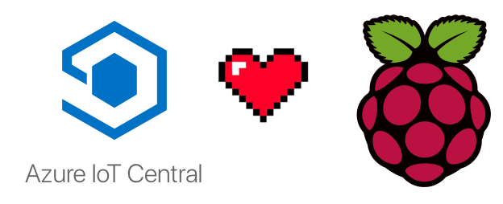
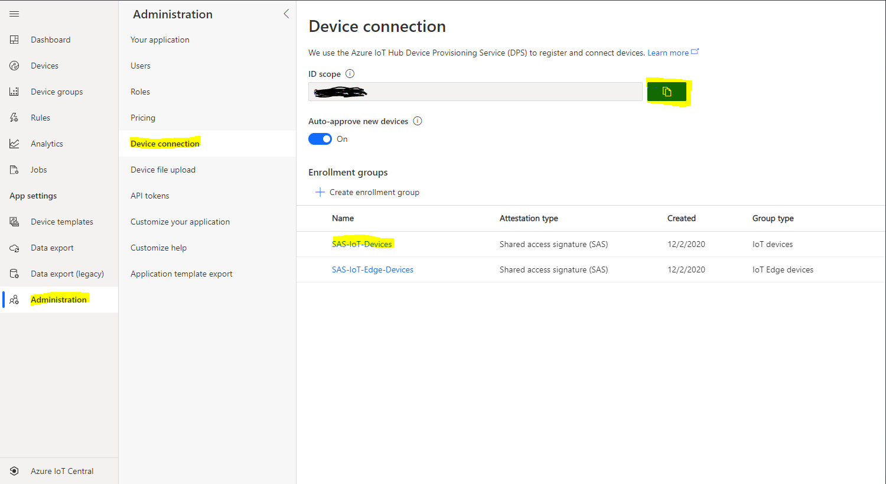
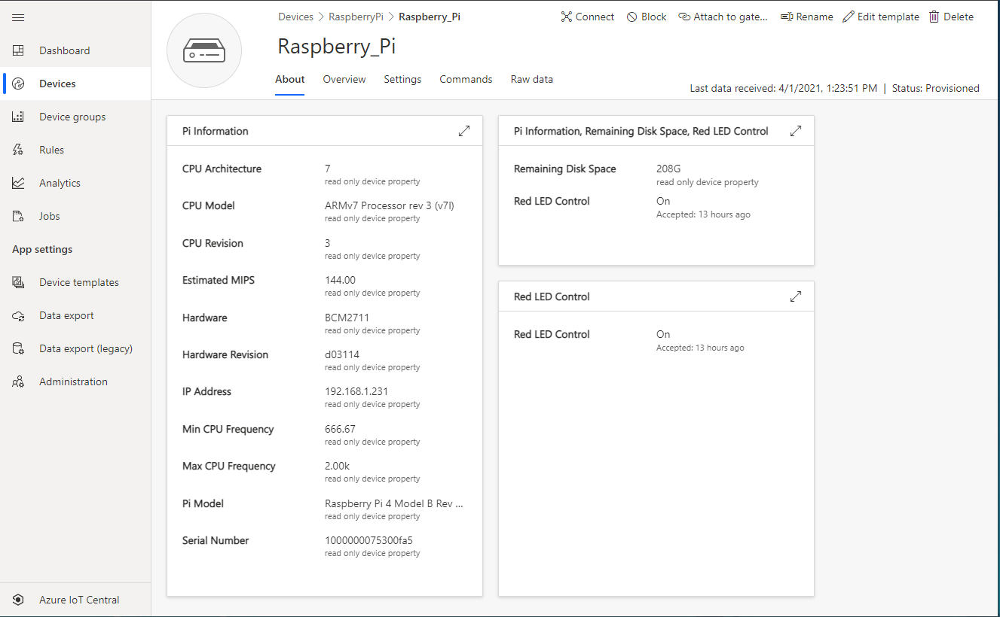
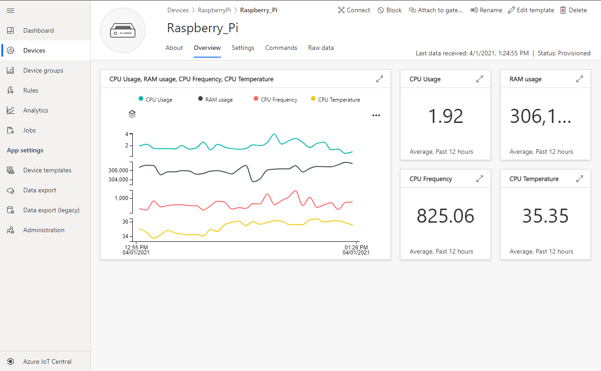
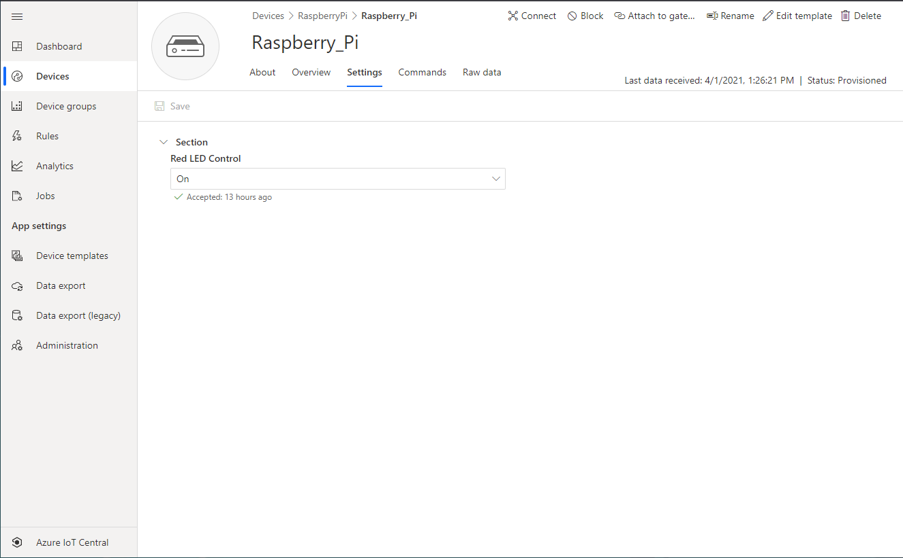
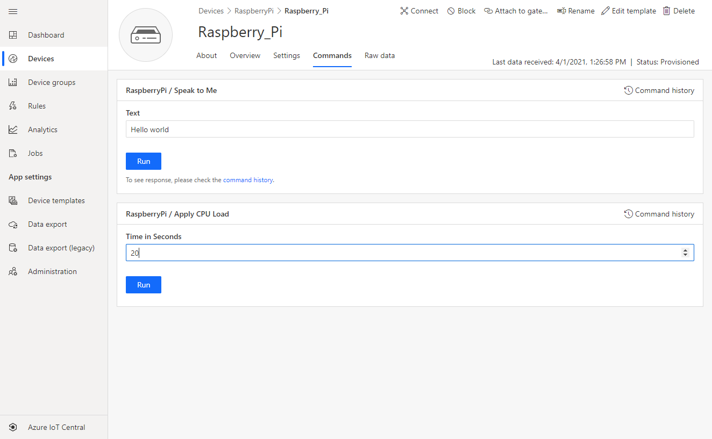
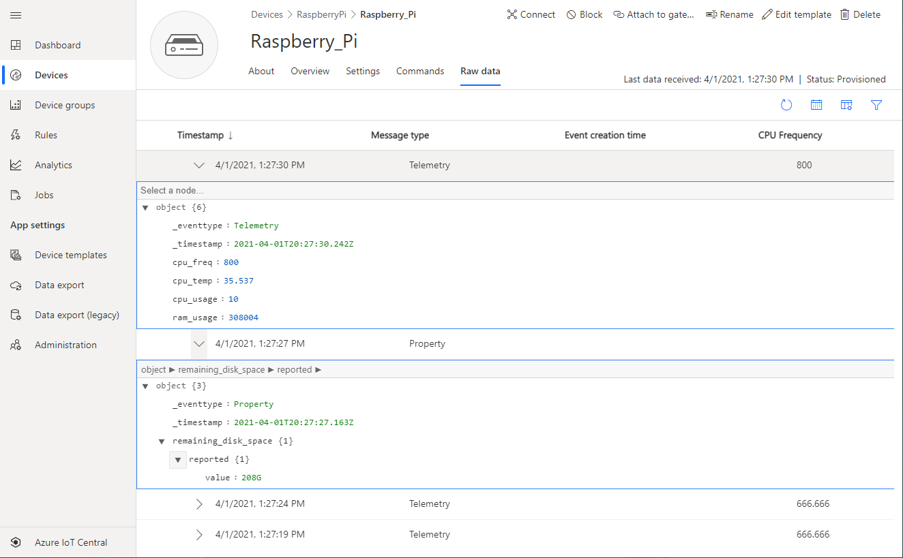

# Getting telemetry from a Raspberry Pi to Azure IoT Central

<p align="center">
  
</p>

## Overview

This project uses a Raspberry Pi to send telemetry and react to commands using Azure IoT Central.  The device will automatically register with IoT Central and start sending telemetry data to your application.  The following features are enabled in this device code:

*	Connects to IoT Central via DPS and self registers against the correctplug-and-play device model.  The model is included in this repository for you to load into your IoT Central application
*	Sends telemetry every 5 seconds including the following information:
    *	Current CPU usage
    *	Current RAM usage
    *	Current CPU temperature
    *	Current CPU frequency
*	On connection it sends reported property information about the device model and CPU information:
    *	cpu_model
    *	cpu_revision
    *	cpu_architecture
    *	hardware
    *	hardware_revision
    *	serial_number
    *	model
    *	estimated_mips
    *	ip_address
    *	min_cpu_frequency
    *	max_cpu_frequency
*	Every 20 seconds it sends the free disk space available on the primary storage media (SD card generally).
*	From IoT Central you can turn the red power LED on and off via a desired property (setting).
*	You can send a "speak to me" command (direct method) that includes a user defined text message.  The Pi will then read that message to you via the headphone jack (just plug in some headphones/ear buds).  This feature uses the software package espeak (see the section "Prerequisites" for install instructions).
*	Use a Cloud to Device command message to induce a CPU load on your Raspberry Pi for a user defined time.  This load will be reflected in the telemetry sent from your Raspberry Pi as the CPU usage increases as does the CPU temperature and CPU frequency.


&nbsp;

## Prerequisites

1. [VS Code](https://code.visualstudio.com/Download)
1. Hardware listed below
1. For the text-to-speech aspect of the device code to work we need to install [espeak](http://espeak.sourceforge.net/) on our Raspberry Pi.  To install espeak open a terminal window or SSH to your Raspberry Pi and run the following command:
    ```sh
    sudo apt update
    sudo apt install espeak
    ```


&nbsp;

### Hardware

| Item | Description | Link |
|-|-|-|
| Raspberry Pi 3 or 4 | Single board computer | [Adafruit](https://www.adafruit.com/product/4292) |
| USB C power supply (Pi 4) | Power cable for Raspberry Pi 4 | [Adafruit](https://www.adafruit.com/product/4298) |
| Micro USB USB power supply (Pi 3) | Power cable for Raspberry Pi 3 | [Adafruit](https://www.adafruit.com/product/1995) |
| SD Card with Raspberry Pi OS | Operating system for the Pi | [Adafruit](https://www.adafruit.com/product/2820) |

&nbsp;

## Setup Azure Resources

First you'll provision the Azure resources needed for this sample. You're going to use IoT Central.

| Resource | Description | Link |
|-|-|-|
| IoT Central | Easy to use cloud IoT solution | https://aka.ms/iotcentral|

&nbsp;

### Preparing your environment

1. If you haven't already, clone this repo to your computer

1. Open command prompt or terminal and navigate to *pi-azure-recipes*

1. In command prompt or terminal type and run ```code 04_iot_central```. This will open the project folder in VS Code

&nbsp;

### Create IoT Central application

1. Next you'll set up an IoT Central application.

1. Go to [IoT Central](https://apps.azureiotcentral.com/) and click the **My apps** on the left navigate menu to login with your Azure account credentials

1. Click the **New application** link at the top of the screen to add a new application.  Select **Custom apps** at the top of the page.  Enter your application name and select the **Free** option for 7 days of no commitment use of IoT Central.  Finally click the **Create** button to provision a free IoT Central application.

1. We need to do some light setup so IoT Central understands our devices capabilities.  Select **Device Templates** in the left navigation menu then click the **+ New** at the top of the page.

1. Select **IoT device** and click **Next: Customize**.  Give your device template a name "RaspberryPi", do **not** check the box "This is a gateway device" and click **Next: Review**.  Review the settings and click **Create**

1. We are going to import a model so click **Import a model** the file dialog will open up and you need to navigate to the directory where you cloned the repository.  In the folder **04_iot_central** you will find the file **raspberry_pi_model.json** select this file and click **open**.  The model should import into IoT Central and you will see the capabilities listed on the screen.

1. By default you will only have one view in Views called **Raw data**, so let's add a couple more.
   1. Click on **Views** and then click on **Generate default views**.
   2. Click the **Generate default dashboard view(s)** button and you should see the Overview and About view generated.
   3. Click the **About** view we can add some other information about our Raspberry Pi.
   4. Drag **Property** from the `Add a tile` list on the left to the main canvas.
   5. Click the pencil icon and under the **Property** label click **+ Capability** and choose **Pi Model**. You can add others by repeating the same process.  Once you have finished, click **Update** to save the tile changes.
   6. Click **Save** in the top bar to save your view changes.
   7. Click **Back** to go back to the template landing page.

1. We need to add one more view to be able to use all our device capabilities.
   1. Click **Views** in the left menu
   2. Click **Editing device and cloud data** button. 
   3. Name the form "Settings" and click the checkbox **Red LED Control**.
   4. Click **Add section** to add the tile to the view. 
   5. Click **Save** to save the view.
   6. Click **Back** to go back to the template landing page.

1. We have completed the device model, now all we need to do is publish the model so it becomes live in our application.  Click the **Publish** link at the top of the page.  You will see a review of changes made then click **Publish**.  The model and views are now live in your application.

1. If you click **Devices** on the left navigation menu you will see your model name listed.  If you click on it you will see that no devices are attached to that model.  The next step is to start the Raspberry Pi code to connect to our application and start sending telemetry

&nbsp;

### Setup you Raspberry Pi Device to start sending telemetry

1. Connect your raspberry Pi to a monitor and keyboard or use the the instructions [here](https://github.com/microsoft/rpi-resources/tree/master/headless-setup) to setup your pi for SSH

2. Using a USB drive or an SSH file transfer software move the files in the *client* folder to the Pi

1. Run the *python_environment_setup.sh* shell script

1. Once the script finishes open the newly created *.env* file

1. You are going to need two pieces of information to connect your Raspberry Pi to your IoT Central application.  In your IoT Central application click **Administration** in the left navigation menu.  Then click **Device connection**, now click the copy blue box to the right of the ID scope to copy the scope id to the clipboard.  Now paste the scope id into the location shown below
    ```
    SCOPE_ID='PASTE-YOUR-SCOPE_ID-HERE'
    ```


1. Now click **SAS-IoT-Devices** and click the copy blue box to the right of the Primary key to copy the key to the clipboard.  Now paste the key into the location shown below
    ```
    GROUP_SYMMETRIC_KEY='PASTE-YOUR-GROUP_SYMMETRIC_KEY-HERE'
    ```

1. In the client folder on your Pi type
    ```sh
    source ./.venv/bin/activate
    ```

1. Then type
    ```sh
    python raspberry_pi_client.py
    ```

1. Your device is now sending telemetry to IoT Hub

&nbsp;

### Using IoT Central with our device

1. Now that the device is sending data to IoT Central lets look at our device in IoT Central and interact with it.  Return to your application and click **Devices** then click on your device template "RespberryPi".  You should see a device has connected and listed.  If not then check to make sure the code is running and the scope_id and group_symmetric_key have been configured correctly on the environment.

1. clicking on the device should open the **About** tab where you can see information about your Raspberry Pi that it has sent to IoT Central.  You can also see the remaining free disk space.



1. Clicking on **Overview** link at the top of the page will show the telemetry information flowing from the device including CPU usage, RAM usage, CPU clock frequency, and CPU temperature.



1. Clicking the **Settings** link will allow you to turn on or off the red LED on the Raspberry Pi.  You can select On or Off and then click the **Save** link to send the setting to the device.  The device will acknowledge the receipt of the setting and show it below the dropdown.



1. Clicking the **Commands** link lets you send a text message you typed in to the Raspberry PI.  If you have headphones or a speaker connected you will hear the text read back to you via the espeak software installed in the prerequisites section.   You can see the command history by clicking **Command History** to the right, you should see that the text sent is also echoed back to the device as a response from the command. This command is a direct method meaning the device must be connected to IoT Central for the command to execute.  The **Apply CPU load** command is a cloud to device command message that will be stored in the cloud for 24 hours waiting for the device to connect and pick up the command.  This command allows you to enter a number of seconds to apply load to the CPU, when run a factorial 100 command is run on the device to simulate load for the set time.  This results in one of the four cores on the CPU maxing out and increases CPU usage by about 25%.  This results in the CPU temperature and usage increasing and can be seen in the **Overview** tabs chart.



1. Finally clicking **Raw Data** shows a raw data view of the telemetry and reported properties from the device.  This is always available regardless of if a device has an associated device template or not.  It is very handy for debugging the device template vs. the data being sent from the device.



&nbsp;

## Clean up Resources

There really is nothing to clean up here as at the end of the seven day trial your application will be deleted.  If you want to delete the application before then you can by clicking **Administration** and clicking the red **Delete** button.  You will be asked to confirm and your application will be deleted.
